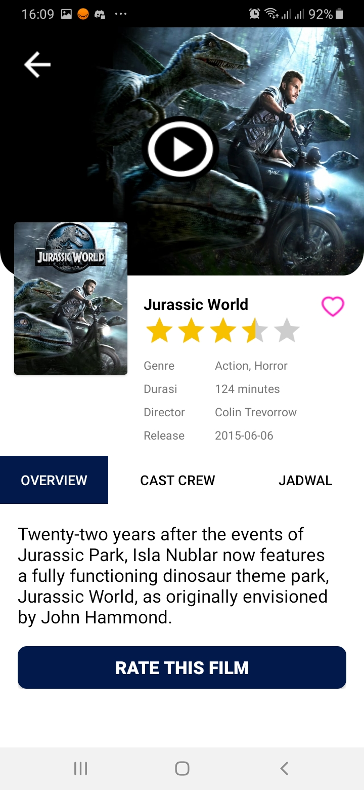
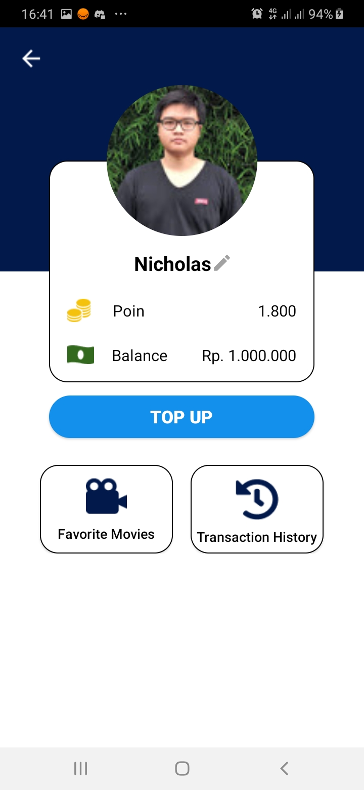
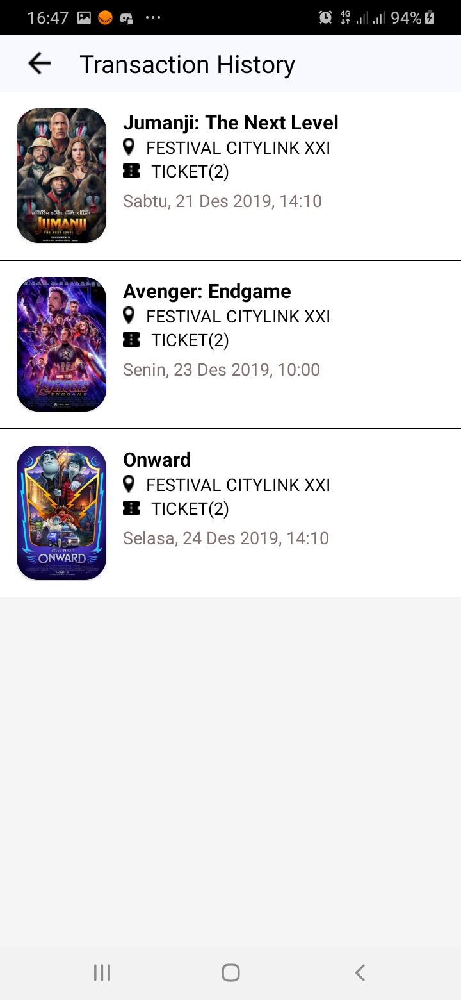

# KWID

KWID is a Movie Theatre Application Android Project that me and @AlexTri12 built for university project. We got inspired by the design 
of Tix ID. We don't copy the whole Tix Id application since we only had 2 weeks before the deadlilne.

KWID use [The Movie Database or TMDB](https://www.themoviedb.org) API to fetch the data. We also use Firebase And SQLite as our database
and authentication.

The criteria for our project are :
 
<ol>
	<li> We have to use authentication, We use Firebase And Google Authentication</li>
	<li> We have to use recycler view, we use recycler view to fetch movies from
	TMDB and shows it as a list</li>
	<li> We ahve to use database CRUD, we use the firestore and SQLITE.  
		Most CRUD operation happens in SQLITE
		<ol>
			<li>Create operation happens when you click the like button and add your favorite movie</li>
			<li>Read operation happens when you want to see your favorite movie</li>
			<li>Update operation happens when you edit your username</li>
			<li>Delete operation happens when you dislike your favorite movie</li>
		</ol>
	</li>
	<li>We have to use Image Loader, KWID use glide library</li>
</ol>

There are total of 14 activities that we created.

## 1. Login activity
You can sign in directly with google account, or you can choose to sign in using
your email and password for this application, we use firebase authentication for this.
if you already logged in, the moment you start this aplication again, you will be directed to home, you don't need to log in again. If you don't have account, you can choose sign in
with google or you can register in register activity.

   

## 2. Register Activity 
In this activity we use firebase authentication email and password.
We included warning messages like if user already registered or the confirm password field doesn't match the password. After you click register, you need to verify your email
address in order to log in.
   

## 3. Forgot Password Activity
Enter your email address and click reset my password. You will have notification
in your email to reset your password
   

## 4. Home Activity
There are 4 section in this activity. Now Playing Movies and Videos are movies that we decided to be shown based on your location input, we just input movie id via firestore and fetch the image and name from TMDB.
if you click the videos, KWID will direct you youtube application and open the movie trailer. 
 
Popular Movie and Top Rated Movie are movies that we fetch directly via TMDB. 
  
The Refresh button will re-fetch the currently showing and videos from firestore, and
sign out button for sign out.
   

  

## 5. Location Activity
This is the list of location available that we input to firestore. 
   

## 6. Movie Detail Activity
This is the activity if you click a movie in Home Activity. We use 3 fragments, overview
cast and crew and schedule (jadwal). You can clik Love button to add the current movie
into your favorite movie list.
   

### 6.a Movie Overview
   

### 6.c Movie Cast and Crew
   

### Movie Schedule (Jadwal)
   

## 7. Seat Selection Activity
If you click Beli tiket (buy ticket) from Schedule Fragment, this activity will appear.
You can choose any seat you want and click order summary (ringkasan order).
   

## 8. Purchase Confirmation Activity
This is the next activity that will appear if you click order summary, it will show you
any information related to schedule, your seat position, price and total price and time. If you click next (lanjutkan), nothing will appear because we don't include any payment method or payment API.
   

## 9. Review Activity
This activity will appear if you click button "RATE THIS FILM" in overview fragment.
we don't add any action in here.
   

## 10. Account Detail Activity
If you click the person icon in top left corner in home activity, Account detail activity
will be shown. In this activity, you can click the <b>Pencil button</b> to edit your username, we use local database SQLITE to update username. The poin and the balance amount are just dummy data.
   

## 11. Top Up Activity
this is the top up activity, here we just show the list of top up method but we 
don't add any external API to really top up your balance.
   

## 12. Favorite Movie Activity
This activity will show you what movies that you like after you click the love button in
movie detail activity.
   

## 13. Transaction History Activity
This activity will show dummy data of transaction.
  

## 14. Notification Activity
This activity will show dummy data of notifications if you click the bell icon in top right
corner of home activity.
   

